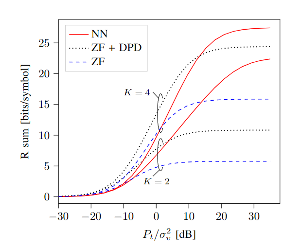

# Writing scientific papers in LaTex (Tips and Tricks)

## General


## Meta

### Highlight updates or inline comments

```latex
\usepackage[dvipsnames]{xcolor} %required package
\newcommand{\update}[1]{{\color{YellowOrange} #1}} %usage \update{this is changed.}
\newcommand{\gilles}[1]{{\color{TealBlue} #1}} %usage \gilles{this is an inline comment of Gilles.}
```


## Math

Typesetting and defining symbols:
```latex
\usepackage{xifthen}
\newcommand{\prob}[1][]{%requires xifthen package%
\ifthenelse{\isempty{#1}}%
      {\ensuremath{P}}%
    {\ensuremath{P\left\(#1\right\)}}%
}
\newcommand{\vect}[1]{\boldsymbol{\mathrm{#1}}}
\newcommand{\mat}[1]{\boldsymbol{\mathrm{#1}}}
\newcommand{\MSE}{\mathrm{MSE}}
\newcommand{\tr}{\mathrm{tr}}
\newcommand{\moddef}{\mathrm{mod}}
\newcommand{\diag}{\mathrm{diag}}
\newcommand{\vecop}{\text{vec}}
\newcommand{\CP}{L}
\newcommand{\hddots}{\hdots}
\newcommand*{\inC}[1]{\in\mathbb{C}^{#1}}
\newcommand{\norm}[1]{\left\lVert#1\right\rVert}
\newcommand{\abs}[1]{\left\lvert#1\right\rvert}
\newcommand{\expt}[1]{\mathbb{E} \left\{#1\right\}}
\newcommand{\cn}[2]{\ensuremath{\sim\mathcal{C}\mathcal{N}\left(#1,#2\right)}}
```


## Glossaries

More information: https://www.overleaf.com/learn/latex/Glossaries
Base LaTex file is located [here](https://github.com/GillesC/abbreviations-latex).

Scripting files to format the file, remove duplicates, merge different abbr files is located [here](https://github.com/GillesC/abbreviations-latex).


## Bibliography

- Clean-up your bib files: https://flamingtempura.github.io/bibtex-tidy/
- I also always enable the "Enclose values in double braces" option to keep the capitalization in titles.

### Use Biblatex
No cite or natbib package is required. For more info check: `https://www.overleaf.com/learn/latex/Bibliography_management_with_biblatex`.
Always be aware there is a difference in citation style and bibliography style.

```latex
\usepackage[backend=biber,style=ieee]{biblatex}
%\usepackage[backend=biber,language=dutch]{biblatex}
\addbibresource{bib.bib}
\AtBeginBibliography{\footnotesize}

\begin{document}

\printbibliography
\end{document}

```


## Tables
- Handy table generator: https://www.tablesgenerator.com/
- I prefer to use the Booktabs table style. An example can be found in the following link: https://nhigham.com/2019/11/19/better-latex-tables-with-booktabs/

## SI-units

```latex
\usepackage[per-mode=symbol]{siunitx}  %usage \SI{35}{\meter\squared}
\DeclareSIUnit{\dBm}{dBm}	% add SI unit "dBm"
```

## Clever reference

```latex
\usepackage[capitalise]{cleveref}  %usage \cref{fig:figureReference}
```
- Standard figure reference gives (\ref) gives: 1
- Cleveref figure references gives (\cref): fig. 1

## Figures

### Python to Tikz

tikzplotlib

### Extract data from existing figures

https://automeris.io/WebPlotDigitizer/


### Indicate lines in a plot

```latex
%draw arc
\draw (x0, y0) arc
    [
        start angle=50,
        end angle=310,
        x radius=0.1cm,
        y radius =0.6cm
    ] ;
    
%draw line 
\draw[] (x1, y1) -- (x2, y2);

%add text
\node[] (x3,  y3) {my text};
```

example: 


